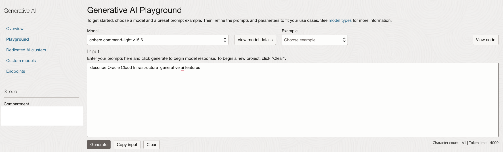

## Procedure to use OCI Generative AI Playground.

The playground is a visual interface for exploring the hosted pretrained and custom models without writing a single line of code. Use the playground to test your use cases and refine prompts and parameters. When you're happy with the results, you can view the code and integrate Generative AI into your applications.

### Procedure 

- Use `OCI console` > `Analytics & AI` > `Generative AI`
- Click `Playground`.

- Select desired model from drop down list .You may click `View model details` to know more about each model available.

- Add desired `input` and click `Generate` to execute the playground.

- You may change the parameters accordingly.Use the tool tip or document to know more about parameters.

- Click `View code` to fetch and execute the same programtically. 

### Read more.
Official documentation - [link.](https://docs.oracle.com/en-us/iaas/Content/generative-ai/concepts.htm)

### Version & Acknowledge.
- V0.0 01/16/2024 [Rahul M R](https://github.com/RahulMR42)

### Back to examples.
----

- 🍿 [Back to OCI Genertive AI Service Samples](./../readme.md)
- 🏝️ [Back to OCI Generative AI sample](./../../readme.md)

